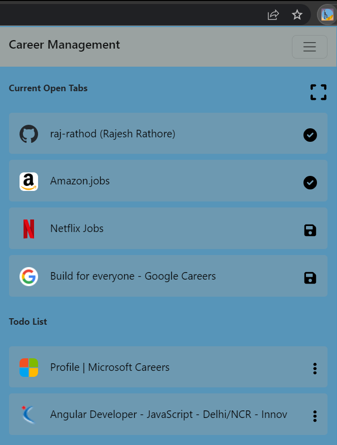
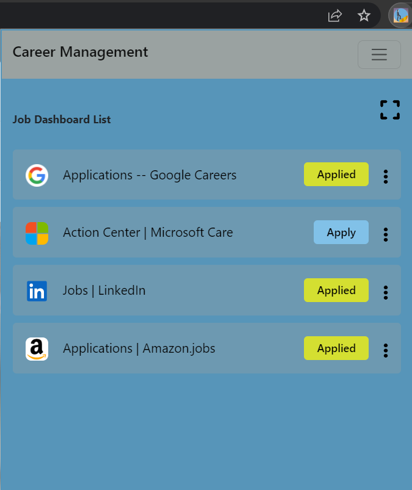
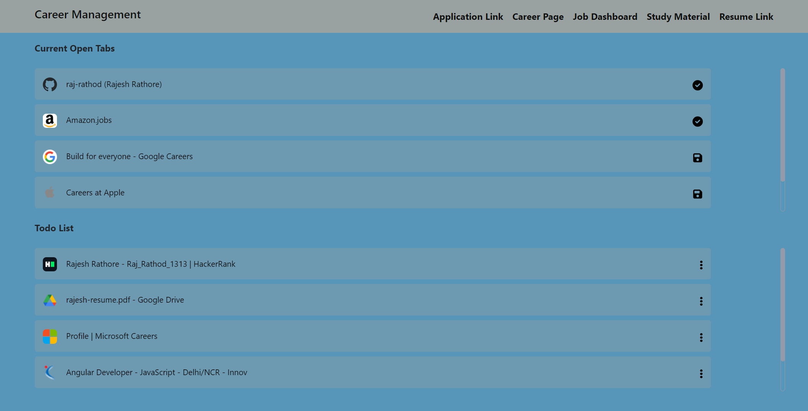
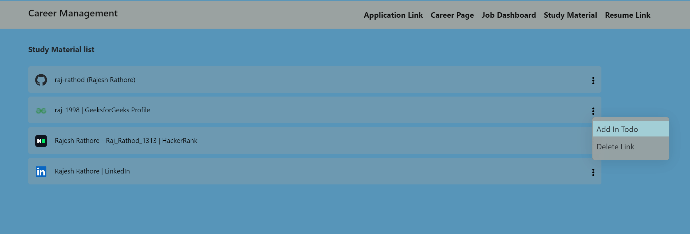
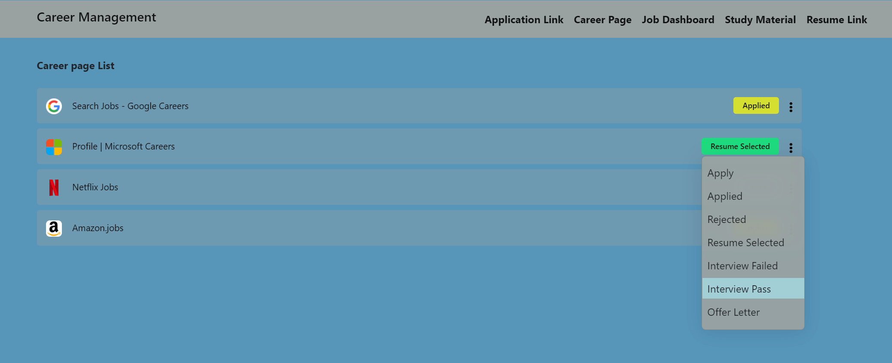

### Hi there, I'm <a href="https://www.sololearn.com/profile/10902790#_=_" target="_blank">Rajesh Rathore</a> 

# Career Management chrome extension

<!-- ### [Check Release](https://raj-rathod.github.io/tic-toc-game/) -->

### Default popup 

 

### Category wise popup

 

 

### Options page

 

### Options category

 

### Status set

 

